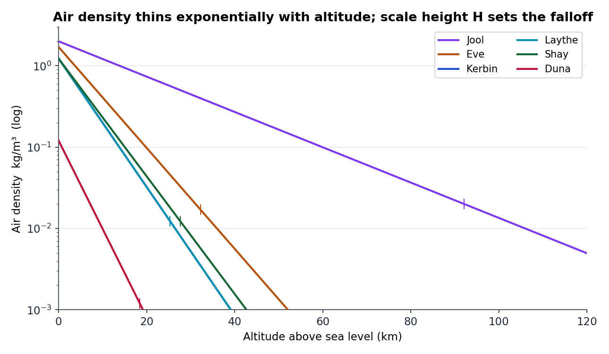
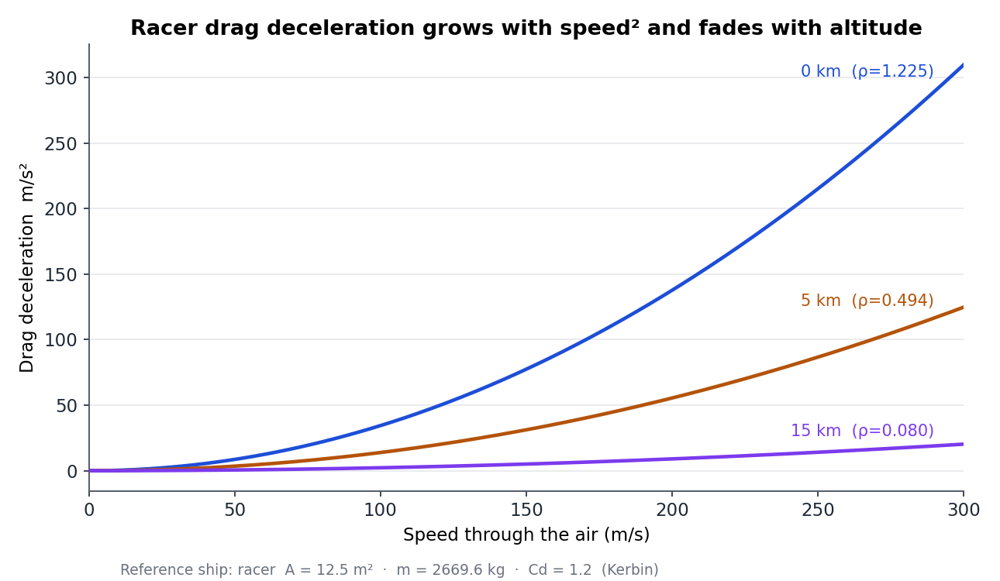

# Atmospheric drag — design & implementation

Date: 2026-09-11
Status: implemented (v1: exponential density + quadratic drag, data-driven,
per-body)

## TL;DR

Bodies that have an atmosphere now push back on a ship moving through it.
The force is the standard quadratic drag law,

```
F = −v̂ · ½ · ρ(alt) · Cd · A · |v|²
ρ(alt) = sea_level_density · exp(−alt / scale_height)
```

applied as a **central force** at the ship's centre of mass every physics
substep, so Bullet divides it by the ship's mass (a heavier ship bleeds less
velocity). The density model is **per-body, data-driven** (two new optional
fields on the existing `surface.atmosphere` block), and the cross-sectional
area `A` is derived from the parts' existing geometry — no new per-part
catalog data. The drag law itself is header-only pure math (`src/drag.h`) so
it is pinned by a GL/Bullet-free unit test, exactly like `surfmap.h` /
`orbit.h`.

This is the physics half of the atmosphere work that began as render-only
limb shells (see `reports/atmosphere2026_08_25`). A body may now draw a limb
rim *and/or* have an atmosphere for physics, independently.

---

## 1. What existed before

- **"Atmosphere" was render-only.** `AtmosphereParams` (terragen.h) carried a
  colour, a Fresnel `power`, an `intensity`, and a shell `thickness`. It drew
  a limb-glow shell + an optional cloud deck. Nothing physical: no density,
  no drag, no air-relative velocity anywhere in `src/`.
- **The physics tick already re-applies forces every substep.** Bullet clears
  accumulated forces on each `stepSimulation`, so gravity (`processGravity`)
  and thrust/control (`applyControlForces`) are re-applied before *every*
  substep in `tick.cpp`. Drag slots into exactly this pattern.
- **A ship in the air is always in its body's rotating frame.** The
  atmosphere is far shallower than the SoI, so a ship never crosses a SoI
  boundary while it still feels air. In that rotating frame the air
  co-rotates with the planet and is *at rest*, so the ship's frame velocity
  (`GetVel()`) **is** the air-relative velocity. No stasis / frame-conversion
  term is needed (the general transform is in `frame.h: GetStasisVelocity`,
  but it is not used here).

## 2. The model

**Density.** Exponential in altitude: `ρ(alt) = ρ₀·e^(−alt/H)`. The altitude
is measured above **sea level** — the fixed reference radius
`radius + sea_level` — *not* above the local terrain. The atmosphere is a
spherically-symmetric shell, so its density depends only on distance from the
body's centre; a ship at a given altitude reads the same air over a peak and
over a valley. (Measuring above the terrain would make it read *denser* over
a peak — backwards; this was the first-cut bug, caught in review.) The
exponential is self-limiting (at `alt = 8H` the density is ~0.03% of sea
level), so there is no hard "atmosphere top".

**Force.** `F = −v̂ · ½·ρ·Cd·A·|v|²`: opposite the air-relative motion,
quadratic in speed. Applied as a central force at the COM, so it decelerates
the ship without adding torque. (v1 has no centre-of-pressure term — no
aerodynamic pitch stability/instability; see §8.)

**Area.** `A = Σ parts (2·radius·height)` — the sum of each part's cylindrical
side-silhouette, from the existing `PartDef.radius/height` (metres). It scales
with ship size and shrinks as stages drop (asparagus), with no new catalog
field. `Cd` is a single global coefficient (default 1.2, the `--drag-cd` knob;
0 disables drag for A/B comparison).

## 3. Where the code goes

| Piece | Location | Change |
|---|---|---|
| Drag law (pure math) | `src/drag.h` (new) | `DragAtmosphere`, `airDensity`, `dragForce` |
| Physical params | `src/terragen.h` `AtmosphereParams` | +`sea_level_density`, `scale_height` (both 0 = no drag) |
| Data parse | `src/system.cpp` (atmosphere block) | read the two new fields (default 0) |
| Force application | `src/vehicle.{h,cpp}` | `applyAtmosphericDrag(h)`, `dragArea()`, `drag_cd` knob, `lastDrag*` state |
| Substep hook | `src/tick.cpp` | call after `processGravity()`; sync `drag_cd`; `--drag-log` instrument |
| CLI | `src/cli.{h,cpp}` | `--drag-cd` (0 = off), `--drag-log` |
| Log clock | `src/game.h` | `drag_log_last_ms` (independent gate, like the other logs) |
| Body data | `res/ksp_system.json` | the two fields on Eve, Kerbin, Shay, Duna, Jool, Laythe |
| Unit test | `tests/test_drag.cpp` (new) + `Makefile` | density + force law, GL/Bullet-free |
| e2e | `e2e/cases/49-drag-ascent.txt` + `e2e/run.py` | `DRAG_RE` + `parse_drag` + the `drag` CHECK namespace; a Duna ascent |

`applyAtmosphericDrag` is a no-op when the body has no physical atmosphere,
the ship is at/below sea level, or it has no speed — so airless bodies and
orbiting ships are untouched, and the EVA kerbal (also a `Vehicle`) feels a
negligible drag on the ground.

## 4. Data model

Optional fields on the existing `surface.atmosphere` block; absent ⇒ `0` ⇒ no
drag (a rim can exist without them and vice versa). Values are KSP-flavoured
placeholders to be tuned:

```json
"atmosphere": {
  "color": [...], "thickness": 15000, "power": 4.0, "intensity": 0.7,  // existing, render
  "sea_level_density": 1.225,    // NEW  kg/m^3 (Kerbin; Duna 0.12, Jool 2.0)
  "scale_height": 5500           // NEW  m    (Duna 4000,  Jool 20000)
}
```

| Body  | ρ₀ (kg/m³) | H (m)  | note |
|-------|-----------|--------|------|
| Kerbin| 1.225     | 5500   | N₂/O₂, Earth-like |
| Laythe| 1.225     | 5500   | N₂/O₂ |
| Shay  | 1.225     | 6000   | N₂/O₂ |
| Eve   | 1.70      | 7000   | dense |
| Duna  | 0.12      | 4000   | thin CO₂ |
| Jool  | 2.00      | 20000  | gas giant (thick, tall) |

### How thick is each atmosphere?

On a log-density axis each body is a straight line whose slope is `1/H`, so the
scale height alone sets how high the air stays meaningful. The `|` ticks mark
where a body has fallen to **1% of sea level** (`alt = H·ln 100 ≈ 4.6H`); past
that the air is too thin to matter. Kerbin and Laythe share identical
parameters, so their curves overlap.



| Body   | ρ₀ (kg/m³) | H (m)  | ρ₀ vs Kerbin | 1% alt (km) | 0.1% alt (km) |
|--------|-----------|--------|-------------|------------|--------------|
| Jool   | 2.00      | 20000  | 1.63×       | 92.1       | 138.2        |
| Eve    | 1.70      | 7000   | 1.39×       | 32.2       | 48.4         |
| Shay   | 1.225     | 6000   | 1.00×       | 27.6       | 41.4         |
| Kerbin | 1.225     | 5500   | 1.00×       | 25.3       | 38.0         |
| Laythe | 1.225     | 5500   | 1.00×       | 25.3       | 38.0         |
| Duna   | 0.12      | 4000   | 0.10×       | 18.4       | 27.6         |

### How hard does it push?

The force is quadratic in speed (deceleration climbs fast) and inherits the
`1/H` falloff in `ρ` (fades with altitude). Reference ship is the **racer**
(`A = 12.5 m²`, `m = 2669.6 kg` full, `Cd = 1.2`); below, sea-level values:



| Body (ρ₀)     | v = 50 m/s | v = 100 m/s | v = 200 m/s |
|---------------|-----------|------------|------------|
| Jool (2.00)   | 14.1 m/s² | 56.2 m/s²  | 224.8 m/s² |
| Eve (1.70)    | 11.9 m/s² | 47.8 m/s²  | 191.0 m/s² |
| Kerbin (1.225)| 8.6 m/s²  | 34.4 m/s²  | 137.7 m/s² |
| Laythe (1.225)| 8.6 m/s²  | 34.4 m/s²  | 137.7 m/s² |
| Duna (0.12)   | 0.8 m/s²  | 3.4 m/s²   | 13.5 m/s²  |

**Reading the numbers.** With the current silhouette-sum area (12.5 m²) and
`Cd = 1.2`, drag is *strong*: at 100 m/s on Kerbin sea level the racer
decelerates at **34 m/s² ≈ 3.5 g** — well above the 9.8 m/s² of gravity. That
is a deliberate coarse starting point (the §7 silhouette sum over-estimates the
true frontal area), and `--drag-cd` (or a per-part `drag_area`, §8.1) is the
lever to dial it into a feel. Duna's thin air is ~10× weaker, which is why the
e2e ascent (case 49) runs there.

## 5. Verification

- **`tests/test_drag.cpp`** (20 checks, `make test`): `ρ(H)=ρ₀/e`, monotone,
  below-surface → 0, degenerate atmosphere → 0; force opposite `v`,
  `|F| = ½ρCdA v²`, `|F(2v)| = 4|F(v)|`, zero on any degenerate input.
- **`e2e/cases/49-drag-ascent.txt`** (`make e2e`): the racer lifts off on
  Duna (the lightest atmospheric body — the heavier ones are below its TWR)
  and the `--drag-log` shows `ρ > 0` and `F > 0` while it moves through the
  air (observed: alt 69→227 m, v 0→28 m/s, drag peaking ~705 N at ρ≈0.118).
- **Full batteries green:** `make test` (all suites) and `make e2e` (49/49,
  incl. the pre-existing thrust/ascent/orbit cases — no regression).

## 6. Known gap: the rails path

At warp ≥ 11 (`kRailsWarp`, `game.h`) ships coast on an analytic Kepler conic
(`railsTick`, `vehicle.cpp`) and the Bullet world is not stepped — so a railed
ship feels **no drag**. That path is deliberately O(ships)/tick and is only
entered at high warp; ascent/descent (where drag matters) happens at warp
1–10 on the physics path, which is covered. LEO orbital *decay* under warp is
the one thing v1 loses. It is documented at the call site (`tick.cpp`) and
here, not silently ignored.

## 7. Assumptions / simplifications

- **Air-relative velocity = `GetVel()`.** Valid because a ship in the air is
  always in its body's rotating frame (atmosphere ≪ SoI). If a future change
  lets a ship feel drag outside the rot frame, the `frame.h` stasis transform
  must be applied to `v_rel` first.
- **Sea-level reference.** `alt = |com| − (radius + sea_level)`. `sea_level`
  is 0 for a landlocked body, so that is altitude above the base radius there.
- **Central force, no torque.** No centre-of-pressure offset, so no aerodynamic
  pitch moment (a rocket will not weathervane or nose-dive on its own).
- **Single-layer exponential.** KSP uses a two-layer model; one layer is
  indistinguishable at the altitudes a ship actually flies and is far simpler.
- **Silhouette-sum area.** `Σ 2rh` double-counts overlapping parts; absorbed
  into the tunable `Cd`. A per-part `drag_area` (KSP-style) is the v2 lever if
  the sum feels off.

## 8. Future enhancements

Ordered roughly by value-per-effort.

1. **Per-part drag area.** A `drag_area` (and cross-drag coefficient) on
   `PartDef`, summed in `dragArea()`. Replaces the silhouette sum with
   authored values; the `--drag-cd` knob and everything else carry over.
2. **Centre of pressure / aerodynamic torque.** Apply the drag at the ship's
   centre of pressure (offset from the COM) instead of centrally, so an
   off-nose flow produces a pitching moment — the stability/instability that
   makes a rocket weathervane. Needs a per-part CoP (or a body-level
   `drag_offset`).
3. **Rails drag.** A cheap velocity-damping term in `railsTick` (or a
   numerical gravity+drag integrator) so LEO decay is visible under warp.
   The one deliberate v1 gap (§6).
4. **Two-layer density.** A second, steeper exponential above a transition
   altitude (the KSP model) for a more realistic upper-atmosphere falloff.
5. **Coupling to the render atmosphere.** The shell `thickness` and the
   physical `scale_height` are independent today; they could be reconciled so
   the visible rim and the physical air agree.
6. **`Cd` in Settings.** Promote `--drag-cd` to the Settings window (it already
   follows the `--exhaust-scale` pattern, so the plumbing exists).

## 9. What we are *not* doing (and why)

- **No per-part drag data in v1.** The silhouette sum needs no catalog change
  and is the lower-commitment choice for very early development; per-part
  areas are the §8.1 refinement.
- **No aerodynamic torque in v1.** A central force is the correct first
  approximation and keeps the change small; the pitch-stability term (§8.2) is
  a separate, larger feature.
- **No rails-path drag in v1.** It is the deliberate gap in §6; closing it
  (§8.3) is a follow-up, not part of the physics-path change.
- **Not tied to `has_sea`.** Air and ocean are unrelated; an explicit
  `sea_level_density`/`scale_height` is cleaner and lets a body have one
  without the other (the render rim already does this).

## 10. Key code references

| Concern | Location |
|---|---|
| Drag law (pure math) | `src/drag.h` — `airDensity`, `dragForce` |
| Physical params | `src/terragen.h:77` `AtmosphereParams` |
| Data parse | `src/system.cpp` (the `surface.atmosphere` block) |
| Force application | `src/vehicle.cpp` `applyAtmosphericDrag` / `dragArea` |
| Substep hook | `src/tick.cpp` (after `processGravity()`) |
| `--drag-log` | `src/tick.cpp` (the `drag_log` block) |
| Rot-frame / stasis (unused here) | `src/frame.h` `GetStasisVelocity` |
| Sea-level reference | `src/terragen.h:302` (`radius + sea_level` = the sea) |
| Unit test | `tests/test_drag.cpp` |
| e2e case | `e2e/cases/49-drag-ascent.txt` |
| Body data | `res/ksp_system.json` (Eve, Kerbin, Shay, Duna, Jool, Laythe) |
